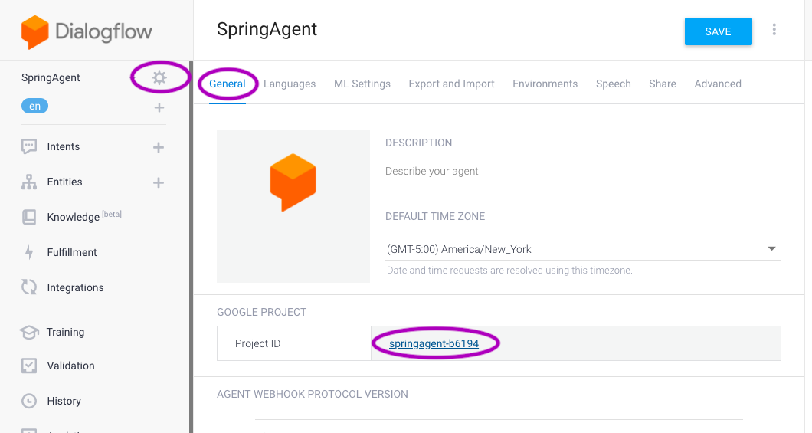
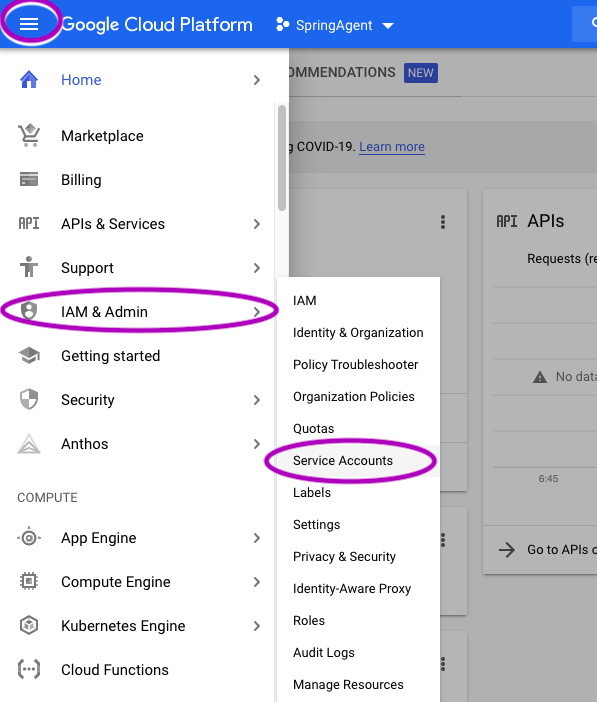
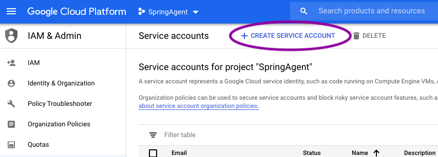
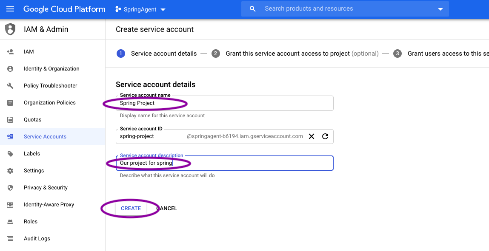
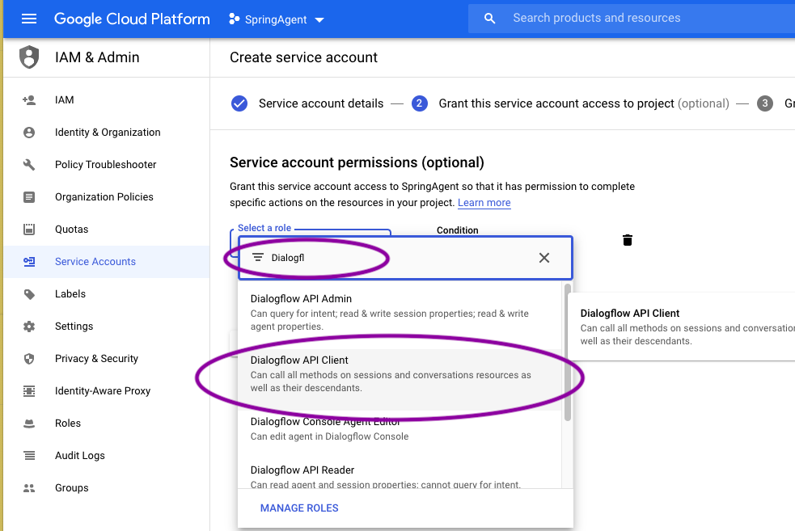
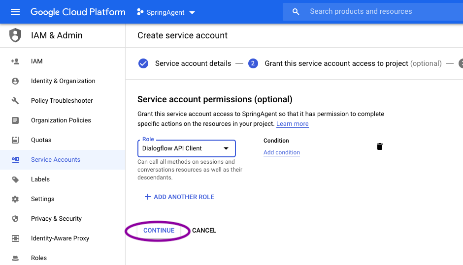
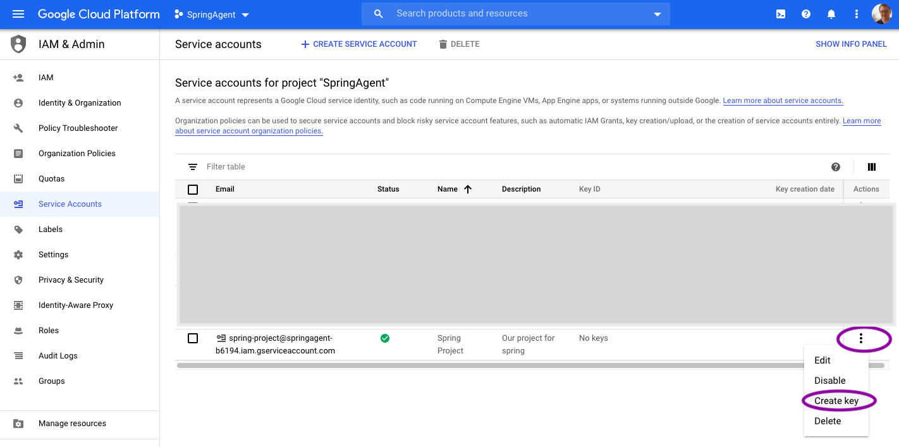
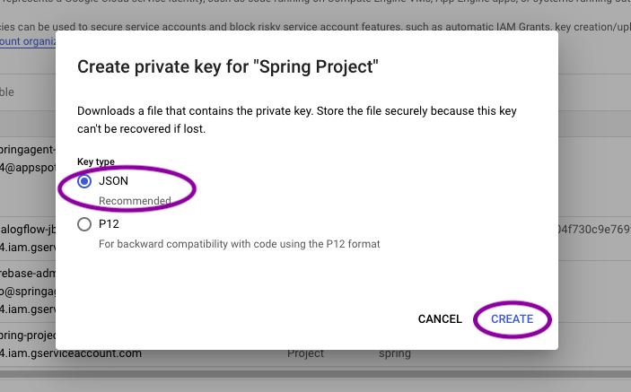

# twilio-dialogflow-bridge

AWS Lambda-based gateway between Twilio & Dialogflow

**_This documentation is a work in progress. Contact me if you're looking to use this code and need help._**

## Getting the Dialogflow credentials

In order for this bridge to work, the code needs access to the credentials file for the Dialogflow project. Here's how to get that file.

In the Dialogflow project, go to the general settings and click on the project link. (If one doesn't exist, use the options to create one.):



Next, use the sidebar menu to navigate to "Service Accounts.":



Choose "+ CREATE SERVICE ACCOUNT":



Give your project a name and description (these are for your reference only and are not public):



We need to give it a role called "Dialogflow API Client," which you can find by starting to type "Dialogflow." Then click "Continue":





Note, there's another screen not shown here. Just leave it as-is and click "Continue" or whatever gets you to the next screen.

Look for the new "service account" in the list, find the `•••` menu on the far right side, and click "Create Key":



Chose "JSON" and click "Create":



This will download a JSON file containing your credentials. Keep it safe! Anyone with this file can get access to the bot. It's this file we need for the bridge to work — it goes in the "secrets" folder of this project.

## Update the secrets files

Put the credentials file from above into a folder called "secrets" at the root level of this project (it's not included in the repo because it's ignored in the `.gitignore` for safety).

In that folder, also put a file called `active_bots.json`. Model it after the [`active_bots.example.json`](./active_bots.example.json) file in this repo. Again, be sure to put `active_bots.json` inside the `secrets` folder.

## Code deployment

Initially deployed lambda function to my AWS account using:

```
./node_modules/.bin/claudia create --region us-east-1 --api-module lambda --role party-bot-executor --memory 512 --timeout 20
```

Subsequent updates:

```
./node_modules/.bin/claudia update
```

## Setting up Twilio

- Add the webhook to the Twilio dashboard using POST and the url for the lambda function, which will look like this `https://lots-of-characters-here.amazonaws.com/latest/bridge` (note you need to add the `bridge` part). 